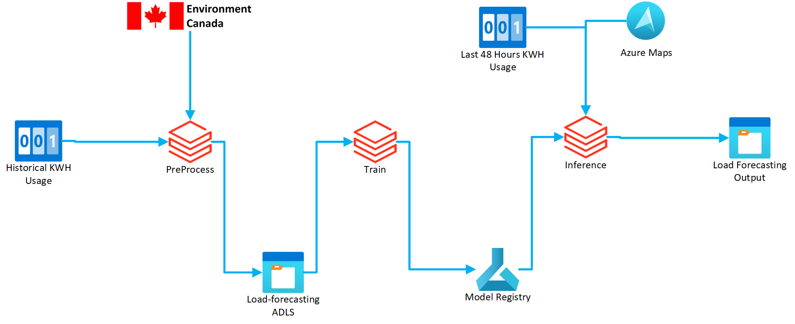
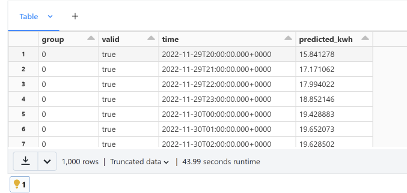

# Load Forecasting using Azure Databricks

## High Level Process & Notebooks





This load forecasting example uses 3 notebooks. 

1. PreProcess - This notebook is responsible for taking input data and converting it into a training dataset to use for the ```Training``` notebook.  This is done by finding the weather data at the ReadingTimestamps in the input data, and saving it into a new output parquet file. 
2. Training - This notebook is resonsible for taking the training dataset and building models for *each grouping* of the input data. 
3. Inference - This notebook is responsible for processing the last hour's worth of consumption and predict the next 24 hours worth of consuption for *each grouping* of meters.  

## Storage Account
Meter data is stored and managed through an ADLS storage account on Azure. 
At a minimum, this example requires a storage acocunt with  access granted to the databricks resource.

> The storage account **must** be mounted as ```/mnt/lf```

### Storage Account - ADLS Structure
The storage account requires the following folder layout. 

```
Load Forecasting Container
└───input
    └───readings.parquet //the input required for the PreProcess notebook
└───training
    └───consumptiondata_withweather_by_meter.parquet
    └───consumptiondata_withweather_by_group.parquet  //used for training
└───inference
    └───current_readings.parquet //used for the inferencing step to generate the lags of the input (48 hours).
    └───_forecast_wx_data //used for caching forecast wx data
└───models 
    └───meter_grouping_1
        └───training_artifacts
    └───meter_grouping_2
        └───training_artifacts
    └───meter_grouping_3
        └───training_artifacts
    .
    .
    .
    └───meter_grouping_n  
        └───training_artifacts
```

## Input Data Format

The notebooks expect the initial data to be in the following schema:

```json
{
  "MeterNumber": "string",
  "ReadingTimestamp": "datetime",
  "KWHConsumption": "double",
  "Latitude", "double",
  "Longitude", "double"
  "Grouping", "string"
}
```

| Property | Description |
|----------|-------------|
| Meter Number | The meter number is used to identify the meter that is  recording the consumption. |
| ReadingTimestamp | The timestamp of the consumption.  This is time at which the consumption occured.  Timestamps should be at regular intervals between the last timestamp, ie contiguous. |
| KWHConsumption | The consumed amount of electricity in KWH (or any other metric) occured between the last timestamp and this timestamp.  We are predicting the consumption at the next interval amount. |
| Latitude | The latitude of the meter, in decimal degrees.  This is used for determining weather. |
| Longitude | The longitude of the meter, in decimal degrees.  This is used for determining weather. |
| Grouping | This is the *grouping* of meters, in which we are predicting load for.  This could be the meter number itself, or things like a transformer identifier, sub stations, etc.  This is what we are going to create models for: A grouping of meters. |


## Training Data Format

The ```PreProcess``` Notebook processes input data into the following training dataset: 
```
MeterNumber:string
ReadingTimestamp:timestamp
TemperatureC:float
DewPointC:float
RelativeHumidity:float
PrecipitationAmountmm:float
WindDirectionDegrees:float
WindSpeedKmh:float
VisibilityKm:float
StationPressurekPa:float
Humidex:float
WindChillC:float
Weather:string
```

This data is then used by the ```Training``` notebook to generate models for each *grouping* that was used. 

## Training Models

This example uses the Azure Storage Account for storing the models and tracking metrics against the models. 
Executing the ```Training``` notebook builds the models in parallel for each grouping in the input data. 

> Using an Azure Machine Learning Model Registry would be the proper way to store and track models.  In a future version of this repo, this change will be made. 

The training happens *per meter grouping* and creates a model per group.  This happens in parallel per group. 

## Inferencing and Forecasting
Once the training is complete and the models have been created, we can now run the inferencing step.  This step requires us to have 48 hours of previous usage. This is saved in ```/lf/inference/current_readings.parquet``` in the format that matches the PreProcess format:

```json
{
  "MeterNumber": "string",
  "ReadingTimestamp": "datetime",
  "KWHConsumption": "double",
  "Latitude", "double",
  "Longitude", "double"
  "Grouping", "string"
}
```

We also need an [Azure Maps](https://azure.microsoft.com/en-us/products/azure-maps/#azuremaps-overview) account and key.  
Locate the azure maps key and client id variables, and enter in yours. 

> Note: In production, the use of key vault and databricks secretes is encouraged

The inferencing notebook runs the model inferencing in parallel against *each model group* specified in the input dataset. 

### Inferencing Output

After the notebook is run, a file on the mounted load forecasting container is outputted to ```/mnt/lf/inference/forecast_bygroup.parquet```. 

 This parquet file has the following schema: 

```json
{
    "group": "string",  //The grouping of the predicted load
    "valid": "boolean", 
    "time": "datetime", //The prediction timestamp
    "predicted_kwh": "double" //The predicted KWH reading for that timestamp
}
```

You can use this in any report that you would like, and show it within Power BI, or any other visualization tool. 

